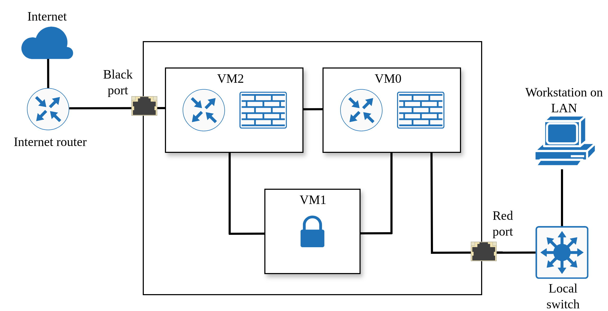
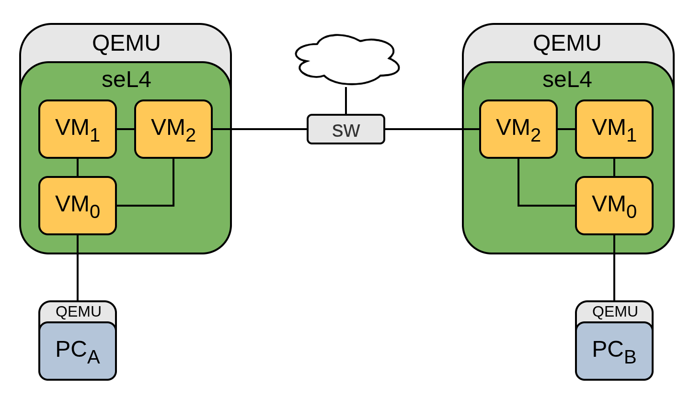
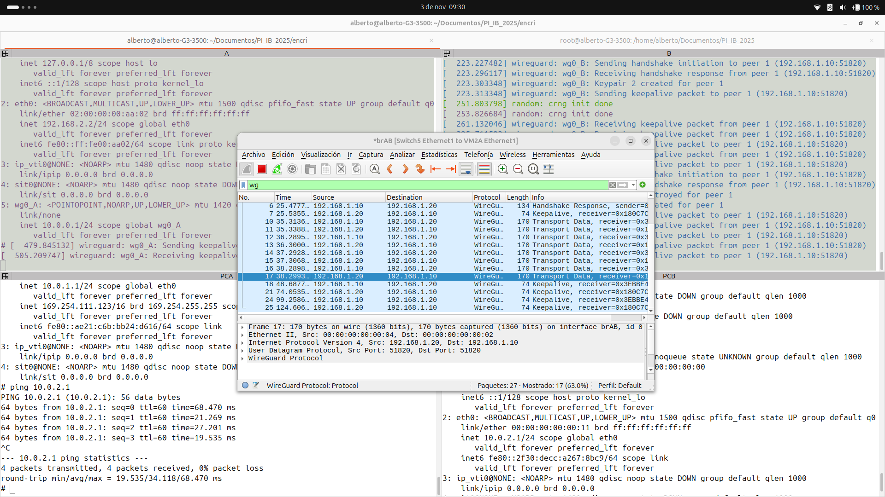
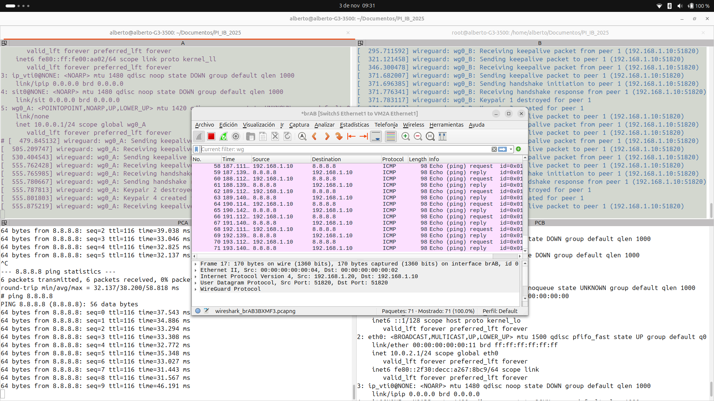

# supermicro_wg — Secure Communication Example using WireGuard

This application extends the existing `zmq_samples` app to demonstrate secure communication using WireGuard between two instances of an encrypter application. This guide illustrates how to deploy and test encrypted messaging on either QEMU or Supermicro E300-9D hardware. Three guest VMs are connected as shown in the diagram below, forming a virtual segmentation between the red and black domains.



The encrypter receives messages from the local LAN into VM0 and forwards them either to VM1 or VM2 based on the destination IP address. If the destination IP belongs to a remote device inside the secure network, the message is sent to VM1 through the WireGuard secure channel and then delivered to VM2. Otherwise, the message is sent directly to VM2 to be masqueraded and forwarded to the Internet.

All three VMs run a customized Linux 6.1.152 kernel with a Buildroot-based RAM disk, including support for WireGuard and minimal networking utilities. Configuration files for the kernel, file system, and generated images are available in the `images` directory.

The `app_settings.cmake` and `CMakeLists.txt` files are configured to build the project with flags `-DPLATFORM=qemu/supermicro` and `-DWG_DEMO=A/B`. The first flag selects the appropriate configuration for hardware passthrough in VM0 and VM2, while the second flag specifies whether the build corresponds to node A or B, which is used only for demonstration purposes.

Each network interface is configured as follows (minor changes in IP addresses exist between WG_DEMO=A and WG_DEMO=B):

| VM   | Interface  | IP Address     | Description                   |
|------|------------|----------------|-------------------------------|
| VM0  | eth0       | 192.168.2.1    |                               |
|      | eth1       | 10.0.x.254     | Incoming traffic from LAN x   |
| VM1  | eth0       | 192.168.2.2    |                               |
| VM2  | eth0       | 192.168.2.3    |                               |
|      | eth1       | 192.168.1.10   | Outgoing traffic to Internet  |

Custom init scripts are installed in each VM to automatically configure the network interfaces, routing rules, iptables, and bring up the WireGuard tunnel.
These scripts reside in `scripts/configs_<WG_DEMO>/` and are copied into the VM overlay directory during the build process.


## Building the example
Currently, the example can be built for QEMU or Supermicro E300-9D hardware. The build process is the same for both platforms, only differing in the `PLATFORM` flag.

See [Setting up your machine](https://docs.sel4.systems/projects/buildsystem/host-dependencies.html) for instructions on how to set up your host machine.

```bash
repo init -u https://github.com/adl09/camkes-vm-examples-manifest.git
repo sync

# Inside seL4 compilation container
mkdir build_qemu_A
cd build_qemu_A
../init-build.sh -DCAMKES_VM_APP=supermicro_wg -DPLATFORM=qemu -DWG_DEMO=A
ninja
```
Repeating the `init-build.sh` process for WG_DEMO=B, a setup with two nodes can be built.



## Running the example
The setup requires four host tap interfaces to interconnect the VMs, as shown above. Use the QEMU commands below to start each VM, running each command in its own terminal window.

### Side A encrypter:
```bash
sudo qemu-system-x86_64 \
    -machine q35,accel=kvm \
    -cpu host \
    -m 2G \
    -kernel build_qemu_A/images/kernel-x86_64-pc99 \
    -initrd build_qemu_A/images/capdl-loader-image-x86_64-pc99 \
    -nographic \
    -serial mon:stdio \
    -device intel-iommu,intremap=off \
    -device e1000e,mac=00:00:00:00:00:01,id=network0.0,netdev=network0,addr=0x3 \
    -netdev tap,ifname=tap_inA,id=network0,script=no,downscript=no \
    -device e1000e,mac=00:00:00:00:00:02,id=network1.0,netdev=network1,addr=0x4 \
    -netdev tap,ifname=tap_outA,id=network1,script=no,downscript=no
```
### Side B encrypter:

```bash
sudo qemu-system-x86_64 \
    -machine q35,accel=kvm \
    -cpu host \
    -m 2G \
    -kernel build_qemu_B/images/kernel-x86_64-pc99 \
    -initrd build_qemu_B/images/capdl-loader-image-x86_64-pc99 \
    -nographic \
    -serial mon:stdio \
    -device intel-iommu,intremap=off \
    -device e1000e,mac=00:00:00:00:00:03,id=network0.0,netdev=network0,addr=0x3 \
    -netdev tap,ifname=tap_inB,id=network0,script=no,downscript=no \
    -device e1000e,mac=00:00:00:00:00:04,id=network1.0,netdev=network1,addr=0x4 \
    -netdev tap,ifname=tap_outB,id=network1,script=no,downscript=no
```

### Side A PC:
```bash
sudo qemu-system-x86_64 \
	-machine q35,accel=kvm \
    -cpu host \
    -m 512 \
    -append "console=ttyS0" \
    -nographic \
    -kernel linux-vm/linux-stable/arch/x86/boot/bzImage \
    -initrd linux-vm/buildroot/output/images/rootfs.cpio \
    -device e1000e,mac=00:00:00:00:00:10,id=network0.0,netdev=network0,addr=0x3 \
    -netdev tap,ifname=tap_PC1,id=network0,script=no,downscript=no
```
### Side B PC:
```bash
sudo qemu-system-x86_64 \
	-machine q35,accel=kvm \
    -cpu host \
    -m 512 \
    -append "console=ttyS0" \
    -nographic \
    -kernel linux-vm/linux-stable/arch/x86/boot/bzImage \
    -initrd linux-vm/buildroot/output/images/rootfs.cpio \
    -device e1000e,mac=00:00:00:00:00:11,id=network0.0,netdev=network0,addr=0x3 \
    -netdev tap,ifname=tap_PC2,id=network0,script=no,downscript=no
```

After starting all VMs, set up the host bridges and tap interfaces as follows (adjust the outgoing interface name if needed):
```bash
sudo -s
for br in brPCA brAB brPCB; do
    ip link add name $br type bridge
    ip link set dev $br up
done
for tap in tap_inA tap_outA tap_inB tap_outB tap_PCA tap_PCB; do
    ip link set dev $tap up
done
ip link set tap_PCA master brPCA
ip link set tap_inA master brPCA
ip link set tap_outA master brAB
ip link set tap_outB master brAB
ip link set tap_inB master brPCB
ip link set tap_PCB master brPCB

ip addr add 192.168.1.100/24 dev brAB
sysctl -w net.ipv4.ip_forward=1
iptables -t nat -A POSTROUTING -s 192.168.1.100/24 -o wlp0s20f3 -j MASQUERADE
```


## Testing the setup
Below are example results when testing connectivity between the two PCs and between a PC and the Internet.




## Hardware implementation comments

### Debugging process on passthrough
An issue was encountered when configuring network interface passthrough on this hardware. The typical process to identify the required passthrough parameters is to boot a bare-metal Linux system and check the parameters using lspci or the following commands:
```
# cat /sys/bus/pci/devices/0000:b5:00.0/irq
11
# cat /sys/bus/pci/devices/0000:b5:00.1/resource
0x00000000f9000000 0x00000000f9ffffff 0x000000000014220c
0x0000000000000000 0x0000000000000000 0x0000000000000000
0x0000000000000000 0x0000000000000000 0x0000000000000000
0x00000000fb000000 0x00000000fb007fff 0x000000000014220c
0x0000000000000000 0x0000000000000000 0x0000000000000000
0x0000000000000000 0x0000000000000000 0x0000000000000000
0x00000000fbd00000 0x00000000fbd7ffff 0x0000000000046200
```
Then, the CAmkES configuration file would look like this:
```
vm0.vm_ioports = [];
vm0.pci_devices = [
{
    "name":"inner_eth",
    "bus":0xb5,
    "dev":0x0,
    "fun":0,
    "irq":"inner_eth_irq",
    "memory":[
        {"paddr":0xfa000000, "size":0x01000000, "page_bits":12},
        {"paddr":0xfb008000, "size":0x00008000, "page_bits":12},
        {"paddr":0xfbd80000, "size":0x00080000, "page_bits":12}
    ]
}
];
vm0.vm_irqs = [
    {"name":"inner_eth_irq", "ioapic":0, "source":11, "level_trig":0, "active_low":1, "dest":10}
];
```

But this approach did not work when booting VM0 and doing `ifconfig`:
```
# ifconfig eth1 up
[  132.282841] i40e 0000:00:01.0 eth1: NIC Link is Up 10 Gbps Full Duplex, Flow Control: None
[  132.282841] IPv6: ADDRCONF(NETDEV_UP): eth1: link is not ready
[  132.294242] 8021q: adding VLAN 0 to HW filter on device eth1
[  132.304242] IPv6: ADDRCONF(NETDEV_CHANGE): eth1: link becomes ready
[  136.079866] i40e 0000:00:01.0 eth1: VSI_seid 391, Hung TX queue 0, tx_pending_hw: 3, NTC:0x3, HWB: 0x3, NTU: 0x6, TAIL: 0x6
[  136.090958] i40e 0000:00:01.0 eth1: VSI_seid 391, Issuing force_wb for TX queue 0, Interrupt Reg: 0x0
```
Also, `cat /proc/interrupts` did not show any interrupts for the device. In some cases, the VM would enter a sort of polling mode (described in [this issue](https://github.com/seL4/camkes-vm/issues/116)). 

The problem found was that the `source` parameter was incorrect. Although the solution was simple, the debugging process to identify it was challenging. The steps are documented below for future reference:
1. Added the following print statement in the `ioapic_map_pin_to_vector` function located in `kernel/src/plat/pc99/machine/ioapic.c`:
    ```c
    printf("Mapping IOAPIC %ld pin %ld to vector 0x%lx\n", (long)ioapic, (long)pin, (long)vector);
    ```
    During the seL4 boot process, this will print all the mappings being created; we are interested in the ones that correspond to the camkes configuration.
    ```c
    // Example output
    Mapping IOAPIC 0 pin 2 to vector 0x32
    Mapping IOAPIC 0 pin 4 to vector 0x34
    Mapping IOAPIC 0 pin 19 to vector 0x3b -> 0x3b = 59
    ```

2. Added a print statement in the `getActiveIRQ` function located in `kernel/include/plat/pc99/plat/machine/interrupt.h`:
    ```c
    if((int)(ARCH_NODE_STATE(x86KScurInterrupt) - IRQ_INT_OFFSET) != 125 &&
       (int)(ARCH_NODE_STATE(x86KScurInterrupt) - IRQ_INT_OFFSET) != 18)
    {
    printf("Active IRQ: %d\n", (int)(ARCH_NODE_STATE(x86KScurInterrupt) - IRQ_INT_OFFSET));
    }
    ```
    Here, you might need to filter out frequent interrupts like the clock and keyboard by adding them to the if condition (mine were 125 and 18). Now, when running `ifconfig up` on the correctly configured interface, the active IRQs will be printed:
    ```c
    // Example output
    # ifconfig eth1 up
    Active IRQ 27 --> 27=0x1b and 0x1b+IRQ_INT_OFFSET(which is 0x20) = 0x3b = 59
    ```

3. Then it was found that you can add multiple IRQ mappings to the same device (for these purposes) in the camkes configuration, like this:
    ```c
    // Example output
    vm0.vm_irqs = [
        {"name":"inner_eth_irq", "ioapic":0, "source":11, "level_trig":0, "active_low":1, "dest":10},
        {"name":"inner_eth_irq", "ioapic":0, "source":12, "level_trig":0, "active_low":1, "dest":11},
        ...
        {"name":"inner_eth_irq", "ioapic":0, "source":19, "level_trig":0, "active_low":1, "dest":15}, // WINNER
    ];
    ```
4. Compare what Active IRQ number is printed when doing `ifconfig up` with the mapping print statements to find the correct source number. You should now have a working passthrough configuration.
    ```
    Connecting to host 10.0.1.254, port 5201
    [  6] local 10.0.1.10 port 36756 connected to 10.0.1.254 port 5201
    [ ID] Interval           Transfer     Bitrate         Retr  Cwnd
    [  6]   0.00-1.00   sec   112 MBytes   943 Mbits/sec    0    301 KBytes       
    [  6]   1.00-2.00   sec   111 MBytes   935 Mbits/sec    0    301 KBytes       
    [  6]   2.00-3.00   sec   112 MBytes   940 Mbits/sec    0    301 KBytes       
    [  6]   3.00-4.00   sec   112 MBytes   940 Mbits/sec    0    301 KBytes       
    ...
    ```


---
### Details on implementation
Current implementation uses two of the four 1GbE ports available on the Supermicro E300-9D hardware. It was intended to use the 10GbE ports in this work, but current limitations were encountered when using multiple devices with the same (ioapic, pin) configuration (it appears that the same pin cannot be mapped to multiple vectors). Booting bare-metal Linux on the hardware and checking the IRQ assignments for the six network interfaces revealed that only a pair of 1GbE interfaces do not share the same IRQ:
```
# cat /sys/bus/pci/devices/0000:b5:00.0/irq
11
# cat /sys/bus/pci/devices/0000:b5:00.1/irq
11
# cat /sys/bus/pci/devices/0000:17:00.0/irq
11
# cat /sys/bus/pci/devices/0000:17:00.1/irq
10
# cat /sys/bus/pci/devices/0000:17:00.2/irq
11
# cat /sys/bus/pci/devices/0000:17:00.3/irq
11
```
The previous debug process to find out the correct IRQ was done for devices 17:00.0/1, too. For this case, IRQs 10 and 11 correspond to sources 17 and 16, respectively.

---
### Performance optimisations
Several iperf tests were performed to evaluate throughput both on passthrough network interfaces and between VMs. The passthrough interfaces achieved around 950Mbps while the throughput between VMs was around 150Mbps. There is a significant bottleneck when transferring data between VMs that needs to be addressed for applications like this one.

Fortunately, side tests using the translation vspace approach proposed in [this PR](https://github.com/seL4/seL4_projects_libs/pull/114/) were performed too. Replacing the corresponding files and enabling the `LibSel4VMUseTranslationVspace` option allowed the example to run at 8x throughput compared to the original implementation. With this modification, the throughput between VMs reached around 1.2Gbps, while the passthrough interfaces remained at 950Mbps because of the 1GbE NIC limitations.


## Underlying modifications
- **projects/vm/components/VM/configurations/connections.h**: The size of virtqueues and descriptor rings was increased following the discussion in this seL4 forum thread: [Virtio-net on multicore ARM system](https://sel4.discourse.group/t/virtio-net-on-multicore-arm-system/598). This change improves performance and prevents errors when transferring large amounts of data (e.g., during iperf tests) between VMs.
- **projects/util_libs/libpci/include/pci/pci.h**: for the Supermicro E300-9D hardware, the `PCI_MAX_DEVICES` constant needs to be increased to detect all PCI devices.
